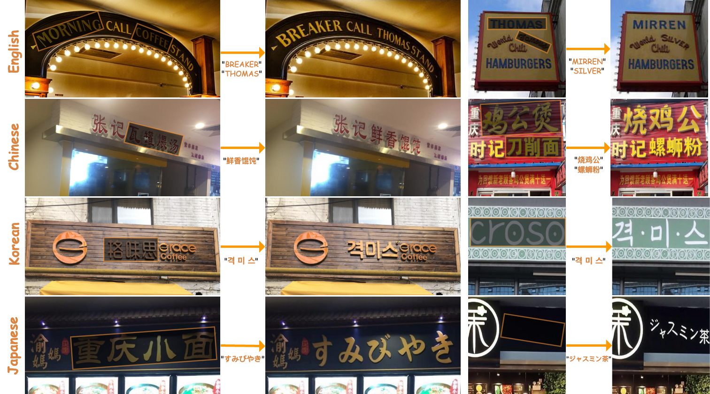

# TextFlux: An OCR-Free DiT Model for High-Fidelity Multilingual Scene Text Synthesis

<div style="display: flex; justify-content: center; align-items: center;">
  <a href="https://arxiv.org/abs/2505.17778">
    
  </a>
  <a href='https://huggingface.co/yyyyyxie/textflux'>
    
  </a>
  <a href="https://github.com/yyyyyxie/textflux">
    
  </a>
  <a href="https://huggingface.co/yyyyyxie/textflux" style="margin: 0 2px;">
    
  </a>
  <a href='https://yyyyyxie.github.io/textflux-site/'>
    
  </a>
  <a href="https://modelscope.cn/models/xieyu20001003/textflux">
  
  </a>
</div>
  <p align="left">
    <strong>English</strong> | <a href="./README_CN.md"><strong>中文简体</strong></a>
  </p>

**TextFlux** is an **OCR-free framework** using a Diffusion Transformer (DiT, based on [FLUX.1-Fill-dev](https://github.com/black-forest-labs/flux)) for high-fidelity multilingual scene text synthesis. It simplifies the learning task by providing direct visual glyph guidance through spatial concatenation of rendered glyphs with the scene image, enabling the model to focus on contextual reasoning and visual fusion.

## Key Features

* **OCR-Free:** Simplified architecture without OCR encoders.
* **High-Fidelity & Contextual Styles:** Precise rendering, stylistically consistent with scenes.
* **Multilingual & Low-Resource:** Strong performance across languages, adapts to new languages with minimal data (e.g., <1,000 samples).
* **Zero-Shot Generalization:** Renders characters unseen during training.
* **Controllable Multi-Line Text:** Flexible multi-line synthesis with line-level control.
* **Data Efficient:** Uses a fraction of data (e.g., ~1%) compared to other methods.

<div align="center">
  
</div>


## Updates

- **`2025/08/02`**: Our full param [**textflux-beta**](https://huggingface.co/yyyyyxie/textflux-beta) weights and [**textflux-lora-beta**](https://huggingface.co/yyyyyxie/textflux-lora-beta) weights are now available! Single-line text generation accuracy performance could be significantly enhanced by **10.9%** and **11.2%** respectively👋! 
- **`2025/08/02`**: Our [**training datasets**](https://huggingface.co/datasets/yyyyyxie/textflux-anyword) and [**testing datasets**](https://huggingface.co/datasets/yyyyyxie/textflux-test-datasets) are now available 👋!
- **`2025/08/01`**: Our [**eval scripts**](https://huggingface.co/yyyyyxie/textflux) are now available 👋!
- **`2025/05/27`**: Our [**Full-Param Weights**](https://huggingface.co/yyyyyxie/textflux) and [**LoRA Weights**](https://huggingface.co/yyyyyxie/textflux-lora) are now available 🤗!
- **`2025/05/25`**: Our [**Paper on ArXiv**](https://arxiv.org/abs/2505.17778) is available 🥳!


## TextFlux-beta Results in Single Line Test Datasets 

This table shows that the TextFlux-beta model achieves a significant performance improvement of approximately **11 points** in single-line text editing, while also boosting inference speed by **1.4 times** compared to previous versions! The [**AMO Sampler**](https://github.com/hxixixh/amo-release) contributed approximately 3 points to this increase. The test dataset is [**ReCTS editing**](https://huggingface.co/datasets/yyyyyxie/textflux-test-datasets). The weights can be found here([**textflux-beta**](https://huggingface.co/yyyyyxie/textflux-beta) , [**textflux-lora-beta**](https://huggingface.co/yyyyyxie/textflux-lora-beta)). 

| Method             | SeqAcc-Editing (%)↑ | NED (%)↑ |  FID ↓   |  LPIPS ↓  | Inference Speed (s/img)↓ |
| ------------------ | :-----------------: | :------: | :------: | :-------: | :----------------------: |
| TextFlux-LoRA      |        37.2         |   58.2   |   4.93   |   0.063   |           16.8           |
| TextFlux           |        40.6         |   60.7   |   4.84   |   0.062   |           15.6           |
| TextFlux-LoRA-beta |        48.4         |   70.5   |   4.69   |   0.062   |           12.0           |
| TextFlux-beta      |      **51.5**       | **72.9** | **4.59** | **0.061** |         **10.9**         |


## Setup

1.  **Clone/Download:** Get the necessary code and model weights.


2. **Dependencies:**

```bash
conda create -n textflux python==3.11.4 -y
conda activate textflux
pip3 install torch torchvision torchaudio --index-url https://download.pytorch.org/whl/cu118

pip install -r requirements.txt
# Ensure diffusers >= 0.32.1 and gradio == 3.50.1
```


## Gradio Demo

Provides "Normal Mode" (for pre-combined inputs) and "Custom Mode" (upload scene image, draw masks, input text for automatic template generation).
```bash
python demo.py
```


## TODO

- [x] Release the training datasets and testing datasets
- [x] Release the training scripts
- [x] Release the eval scripts
- [ ] Support comfyui


## Acknowledgement

Our code is modified based on [Diffusers](https://github.com/huggingface/diffusers). We adopt [FLUX.1-Fill-dev](https://huggingface.co/black-forest-labs/FLUX.1-Fill-dev) as the base model. Thanks to all the contributors for the helpful discussions! We also sincerely thank the contributors of the following code repositories for their valuable contributions: [AnyText](https://github.com/tyxsspa/AnyText), [AMO](https://github.com/hxixixh/amo-release).


## Citation

```bibtex
@misc{xie2025textfluxocrfreeditmodel,
      title={TextFlux: An OCR-Free DiT Model for High-Fidelity Multilingual Scene Text Synthesis}, 
      author={Yu Xie and Jielei Zhang and Pengyu Chen and Ziyue Wang and Weihang Wang and Longwen Gao and Peiyi Li and Huyang Sun and Qiang Zhang and Qian Qiao and Jiaqing Fan and Zhouhui Lian},
      year={2025},
      eprint={2505.17778},
      archivePrefix={arXiv},
      primaryClass={cs.CV},
      url={https://arxiv.org/abs/2505.17778}, 
}
```
