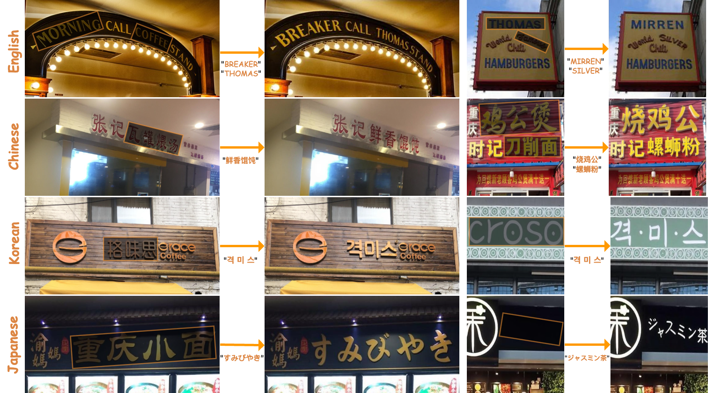

# TextFlux: An OCR-Free DiT Model for High-Fidelity Multilingual Scene Text Synthesis

<div style="display: flex; justify-content: center; align-items: center;">
  <a href="https://arxiv.org/abs/2505.17778">
    
  </a>
  <a href='https://huggingface.co/yyyyyxie/textflux'>
    
  </a>
  <a href="https://github.com/yyyyyxie/textflux">
    
  </a>
  <a href="https://huggingface.co/yyyyyxie/textflux" style="margin: 0 2px;">
    
  </a>
  <a href='https://yyyyyxie.github.io/textflux-site/'>
    
  </a>
  <a href="https://modelscope.cn/models/xieyu20001003/textflux">
  
  </a>
</div>
  <p align="left">
    <strong>中文简体</strong> | <a href="./README.md"><strong>English</strong></a>
  </p>

**TextFlux** 是一个**OCR-free的框架**，它使用 Diffusion Transformer (DiT，基于 [FLUX.1-Fill-dev](https://github.com/black-forest-labs/flux)) 来实现高保真的多语言场景文本合成。它通过将渲染的字形与场景图像进行空间拼接，为模型提供直接的视觉字形指导，从而简化了学习任务，使模型能够专注于上下文推理和视觉融合。

## 主要特性

* **OCR-free：** 简化的架构，无需OCR编码器。
* **高保真且上下文风格一致：** 精确渲染，与场景风格一致。
* **多语言和低资源：** 在各种语言中表现出色，仅需少量数据（例如，少于1000张图片）即可适应新语言。
* **零样本泛化：** 能够渲染训练期间未见过的字符。
* **可控多行文本：** 灵活的多行文本合成，具有行级控制能力。
* **数据高效：** 与其他方法相比，仅使用一小部分数据（例如，约1%）。

<div align="center">
  
</div>

## 最新动态

-   **`2025/05/27`**: 我们的 [**全参数权重**](https://huggingface.co/yyyyyxie/textflux) 和 [**LoRA 权重**](https://huggingface.co/yyyyyxie/textflux-lora) 现已发布 🤗！
-   **`2025/05/25`**: 我们的 [**论文已在 ArXiv 上发布**](https://arxiv.org/abs/2505.17778) 🥳！

## 安装

1.  **克隆/下载：** 获取必要的代码和模型权重。
2.  **依赖项：**
    ```bash
    conda create -n textflux python==3.11.4 -y
    conda activate textflux
    pip3 install torch torchvision torchaudio --index-url [https://download.pytorch.org/whl/cu118](https://download.pytorch.org/whl/cu118)
    pip install -r requirements.txt
    cd diffusers
    pip install -e .
    # 确保 gradio == 3.50.1
    ```

## Gradio 演示

提供“普通模式”（用于预组合的输入）和“自定义模式”（上传场景图片、自行手动绘制掩码、输入文本以自动生成模板）。

```bash
python demo.py
```

## TODO

- [ ] 发布训练数据集和测试数据集
- [ ] 发布训练脚本
- [ ] 发布评估脚本
- [ ] 支持 ComfyUI

## 致谢

我们的代码基于 [Diffusers](https://github.com/huggingface/diffusers) 修改。我们采用 [black-forest-labs/FLUX.1-Fill-dev](https://huggingface.co/black-forest-labs/FLUX.1-Fill-dev) 作为基础模型。感谢所有贡献者参与的讨论！


## 引用

```bibtex
@misc{xie2025textfluxocrfreeditmodel,
      title={TextFlux: An OCR-Free DiT Model for High-Fidelity Multilingual Scene Text Synthesis}, 
      author={Yu Xie and Jielei Zhang and Pengyu Chen and Ziyue Wang and Weihang Wang and Longwen Gao and Peiyi Li and Huyang Sun and Qiang Zhang and Qian Qiao and Jiaqing Fan and Zhouhui Lian},
      year={2025},
      eprint={2505.17778},
      archivePrefix={arXiv},
      primaryClass={cs.CV},
      url={https://arxiv.org/abs/2505.17778}, 
}
```
